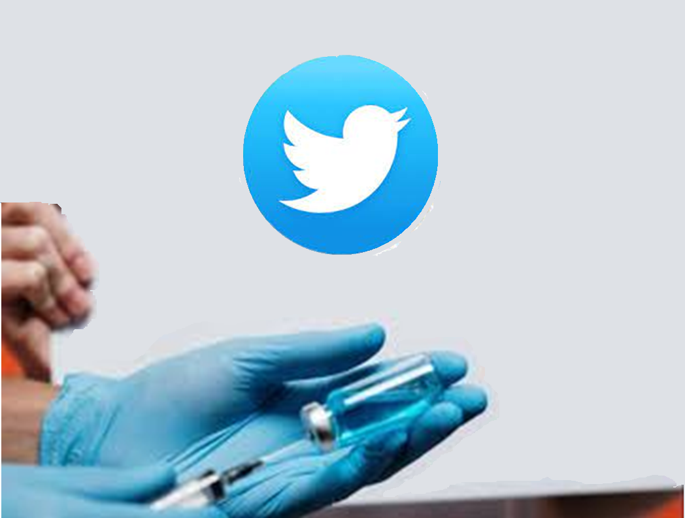
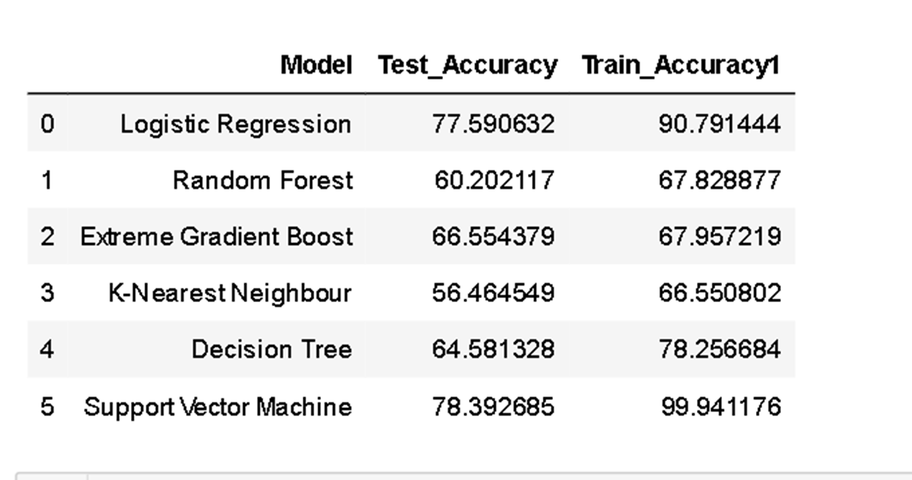

#  NLP_Vaccine_SentimentAnalysis_Tweets

Currently we know COVID-19 continues to be a global crisis, there is one way to get out of the pandemic completely and that is Vaccination. The sentiment towards the vaccine has always been a mixed one as there always is a theory why one should have it and there is another which says not to have.  

Just for a basic understanding A **vaccine** works by training the **immune** system to recognize and combat pathogens, either **viruses or bacteria**. The **sentiment** towards having vaccine has been always a mixed and Vaccine sentiment has too not dramatically changed. The tweeting community has become a strong one but is no different when it comes to the sentiment and the feel is that the tweeting community can play a great role in changing but the question is are they doing enough ?

**The goal here is to do sentiment analysis in the tweet community and conclude on how the community can further improve in shifting the sentiment**

The Process followed & libraries used

- **Pulled in Data using TWINT**
- **For EDA used Pandas - Numpy - Seaborn - Matplotlib** 
- **Used NLTK for word tokenizing - stopwords - lemmatizing - porter stemmer- FreqDist**
- **Nltk-util for ngrams**
- **For adding Sentiment used Text blob**
- **scikit learn for feature extraction, **(count vectorization,Tfid vectorization), **model selection**, **Stratified Shuffle Split**, **linear_model** - LogisticRegression, **metrics** confusion_matrix, **naive_bayes-** MultinomialNB, **ensemble**-RandomForestClassifier, **tree**DecisionTreeClassifier
- **Bag of words using genism & Latent Dirichlet Allocation (the LDA Model)**
- **Python LDA for visualization (pyLDAvis**)
- **Wordcloud for visualisation**

**TWINT**

*Total tweets collected were 25774 from 2013-02-17 to  2021-05-02

*Analysed tweets were 24934 from 2020-01-01 to 2021-05-02 

*6 Search Words = "vaccine" "vaccination“ "immunization" "Pfizer" "Moderna" "Johnson“

**Exploratory Data Analysis**

1. Tweets by NEWS channel handle within collected data from 2013-02-17 to  2021-05-02
   - @nytimes **(49.9m followers) has only 86 tweets regarding Vaccine
   - **@** **cnnbrk****** **(60.2m followers) has only 47 tweets regarding** **Vaccine \*** * **most popular tweeter news account**
   - **@** **usnews**  **(158.1k followers) has no tweets regarding Vaccine**
2. 

- Clearly the number of tweets with regards to vaccine has been the highest month of April 2021
- Jan 2021 & Feb 2021 had a dip in the number of tweets after taking off in Dec 2020

3 . **TEXT BLOB**

The Analysis which has been done is based on Polarity and Subjectivity

***Polarity** - For positive-negative-neutral Sentiment

***Subjectivity**- quantifies the amount of personal opinion and factual information contained in the text. The subjectivity was further divided into objective and subjective, the higher subjectivity means that the text contains personal opinion rather than factual information which gets reflected on the objective part

**The overall tweets that we came across has been positive and objective** so we can safely say that the g people who are tweeting have added a more of factual information than their just their personal opinion.

**Sentiment Polarity** 

The above graph shows us that people want to stay neutral when they have some factual information.

The **Ngrams** gave some interesting information like some of the top 4 words frequently used were:

- about what in the 
- what in the vaccine - 
- worry about what in

these words probably reveal that people are curious or worried about what is in the vaccine.

**THE WORDCLOUD**

After lot of efforts a clean word cloud did give a lot of words which can be attributed towards a positive feel about having the vaccine and being safe

The train and test accuracy gave out Support vector machine model as the best model and the base model logistic regression was not far behind in terms of accuracy

 
